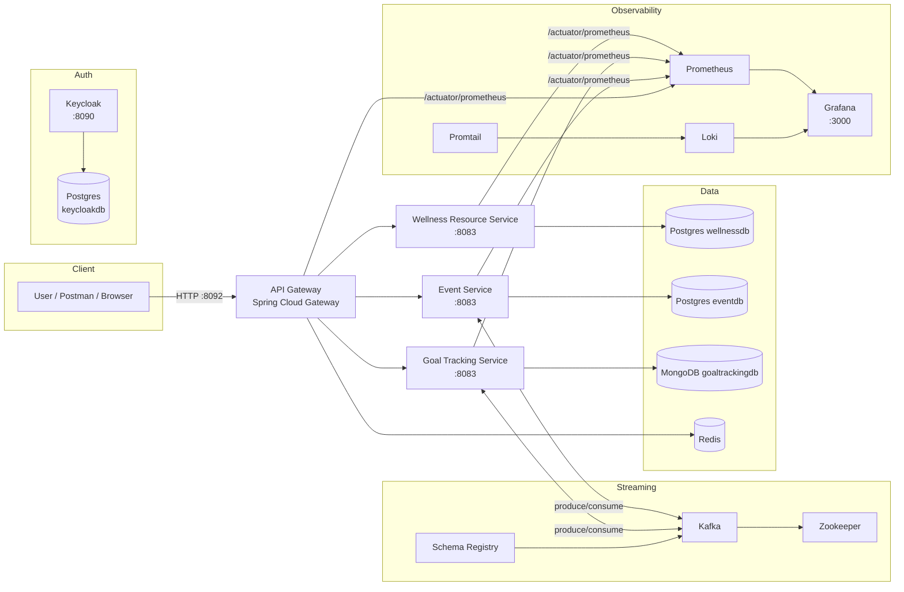

# Wellness Hub — Spring Microservices (Gateway + Keycloak + Kafka + Observability)

A production-style microservices system built with **Spring Boot** and **Spring Cloud Gateway**, secured with **Keycloak (OIDC/JWT)**, using **Kafka** for async messaging and **PostgreSQL/MongoDB/Redis** for persistence + caching. Includes an **observability stack** with **Prometheus + Loki + Promtail + Grafana**.

> This repo is structured to be recruiter-friendly: one-command local boot, clear docs, and predictable service layout.

## What’s inside
- **API Gateway** (Spring Cloud Gateway) — single entry point
- **Wellness Resource Service** — PostgreSQL
- **Goal Tracking Service** — MongoDB (+ Kafka producer/consumer)
- **Event Service** — PostgreSQL (+ Kafka integration)
- **Auth**: Keycloak realm import (Docker)
- **Streaming**: Kafka + Zookeeper + Schema Registry
- **Observability**: Prometheus + Grafana + Loki + Promtail

## Architecture
The system is event-driven and routed through the gateway.



## Quickstart (Local with Docker)
### 1) Start everything
```bash
docker compose up --build
```

### 2) Open the UIs
- **API Gateway**: http://localhost:8092  
- **Keycloak**: http://localhost:8090  (admin/admin)
- **Grafana**: http://localhost:3000 (admin/admin)
- **Prometheus**: http://localhost:9090

### 3) Smoke test
```bash
bash scripts/smoke-test.sh
```

## API routing (via Gateway)
- `/api/resources/**` → Wellness Resource Service
- `/api/goals/**` → Goal Tracking Service
- `/api/events/**` → Event Service

Swagger via Gateway:
- `/api/swagger-ui/wellness/`
- `/api/swagger-ui/goals/`
- `/api/swagger-ui/events/`

## Postman collection
Import: `Wellness_Hub_API.postman_collection.json`

## Notes for public GitHub
This repo intentionally excludes any course PDFs/checklists. Keep public repos focused on runnable code + documentation.

## Tech stack
Java, Spring Boot, Spring Cloud Gateway, Keycloak, Kafka, PostgreSQL, MongoDB, Redis, Docker Compose, Prometheus, Grafana, Loki
